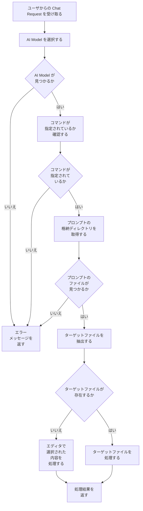

あなたはソースコードの理解を助けるために、mermaidを使ってフローチャート図を生成するツールを開発することになりました。ソースコードを解析し、その処理の流れを表すmermaidのフローチャートを日本語で生成してください。

フローチャート図の生成に際して、以下の点に注意してください：

1. 関数呼び出しをそのまま表現するのではなく、処理の内容に沿った適切な表現を行うこと。
1. 関数のドキュメンテーション文字列の情報も考慮に入れること。
1. 変数への代入や出力処理も図に含めること。
1. フローチャート図中の図形の中で文字列の表示が途切れないように、助詞の次に必ず" "を入れて改行を行うこと。

mermaidのフローチャート図の形式で出力してください。

# 具体例

