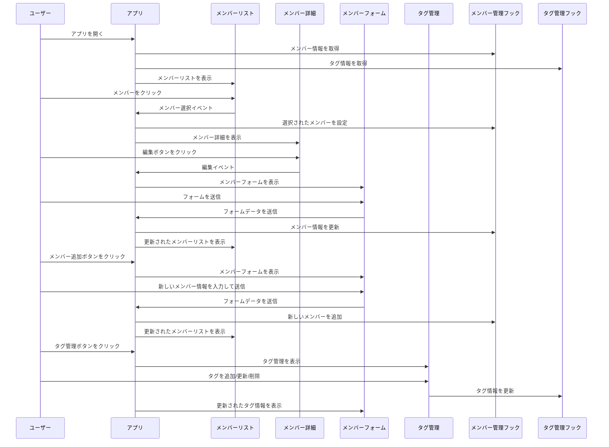

## Prompt file: 01_mermaid_sequence.md

```mermaid
sequenceDiagram
    participant User as ユーザー
    participant App as アプリ
    participant MemberList as メンバーリスト
    participant MemberDetail as メンバー詳細
    participant MemberForm as メンバーフォーム
    participant TagManagement as タグ管理
    participant useMembers as メンバー管理フック
    participant useTags as タグ管理フック

    User ->> App: アプリを開く
    App ->> useMembers: メンバー情報を取得
    App ->> useTags: タグ情報を取得
    App ->> MemberList: メンバーリストを表示

    User ->> MemberList: メンバーをクリック
    MemberList ->> App: メンバー選択イベント
    App ->> useMembers: 選択されたメンバーを設定
    App ->> MemberDetail: メンバー詳細を表示

    User ->> MemberDetail: 編集ボタンをクリック
    MemberDetail ->> App: 編集イベント
    App ->> MemberForm: メンバーフォームを表示

    User ->> MemberForm: フォームを送信
    MemberForm ->> App: フォームデータを送信
    App ->> useMembers: メンバー情報を更新
    App ->> MemberList: 更新されたメンバーリストを表示

    User ->> App: メンバー追加ボタンをクリック
    App ->> MemberForm: メンバーフォームを表示

    User ->> MemberForm: 新しいメンバー情報を入力して送信
    MemberForm ->> App: フォームデータを送信
    App ->> useMembers: 新しいメンバーを追加
    App ->> MemberList: 更新されたメンバーリストを表示

    User ->> App: タグ管理ボタンをクリック
    App ->> TagManagement: タグ管理を表示

    User ->> TagManagement: タグを追加/更新/削除
    TagManagement ->> useTags: タグ情報を更新
    App ->> MemberForm: 更新されたタグ情報を表示
```

