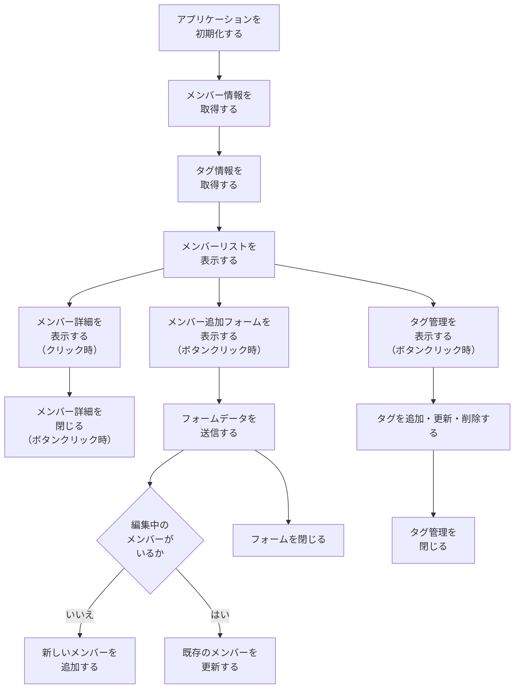

## Prompt file: 02_mermaid_flowchart.md

```mermaid
graph TD
    A[アプリケーションを<br>初期化する] --> B[メンバー情報を<br>取得する]
    B --> C[タグ情報を<br>取得する]
    C --> D[メンバーリストを<br>表示する]
    D --> E[メンバー詳細を<br>表示する<br>（クリック時）]
    E --> F[メンバー詳細を<br>閉じる<br>（ボタンクリック時）]
    D --> G[メンバー追加フォームを<br>表示する<br>（ボタンクリック時）]
    G --> H[フォームデータを<br>送信する]
    H --> I{編集中の<br>メンバーが<br>いるか}
    I -- いいえ --> J[新しいメンバーを<br>追加する]
    I -- はい --> K[既存のメンバーを<br>更新する]
    H --> L[フォームを閉じる]
    D --> M[タグ管理を<br>表示する<br>（ボタンクリック時）]
    M --> N[タグを追加・更新・削除する]
    N --> O[タグ管理を<br>閉じる]
```

