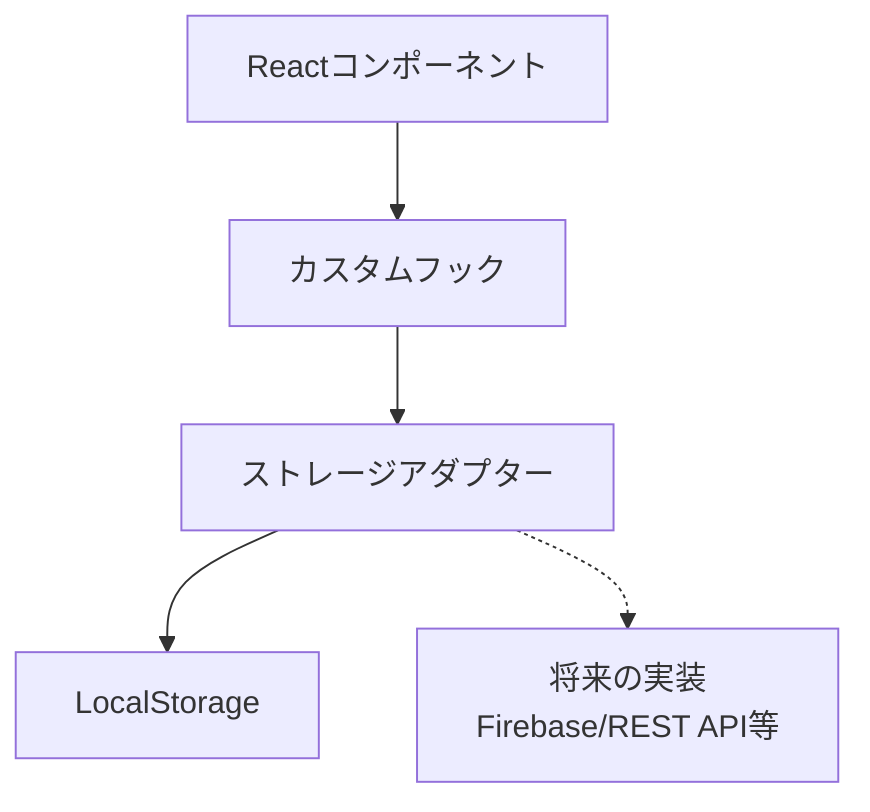
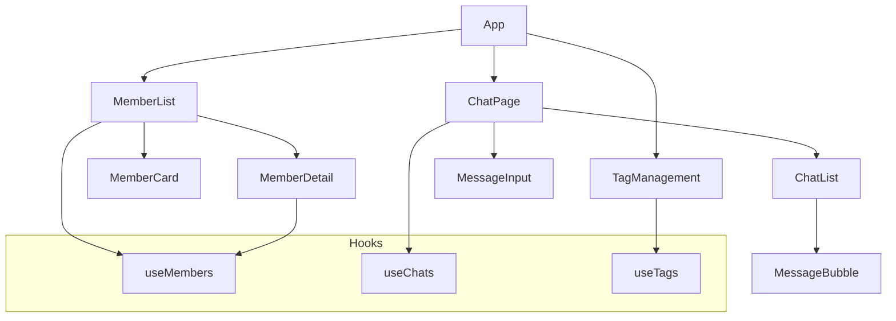

# System Patterns

## Architecture Overview

### Storage Pattern


### Component Structure


## Design Patterns

### Custom Hooks
- `useMembers`: Manages member data and operations
- `useChats`: Handles chat functionality and message state
- `useTags`: Controls tag creation and management

### Component Patterns
1. Container Components
   - MemberList
   - ChatPage
   - TagManagement

2. Presentational Components
   - MemberCard
   - MessageBubble
   - MessageInput

### State Management
- Custom hooks for domain-specific state
- Component-level state for UI interactions
- Prop drilling minimized through hook usage

## Data Flow
1. Member Management
   ```mermaid
   flowchart LR
       useMembers --> MemberList
       useMembers --> MemberDetail
       useMembers --> MemberForm
   ```

2. Chat System
   ```mermaid
   flowchart LR
       useChats --> ChatList
       useChats --> MessageInput
       ChatList --> MessageBubble
   ```

3. Tag System
   ```mermaid
   flowchart LR
       useTags --> TagManagement
       useTags --> MemberDetail
   ```

## Technical Decisions
1. React + TypeScript for type safety
2. Vite for fast development experience
3. Custom hooks for state management
4. Component-based architecture
5. Modular CSS for styling
6. Storage adapter pattern for data persistence
7. LocalStorage implementation with future extensibility
